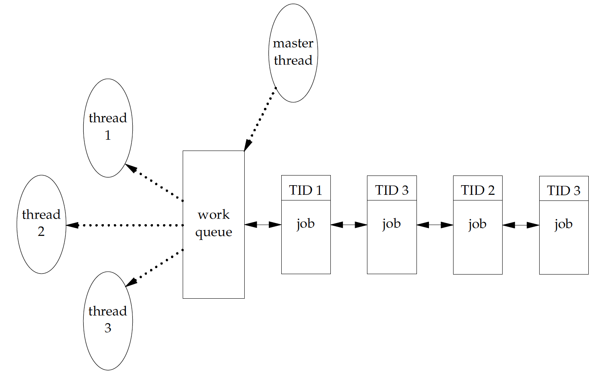

[TOC]

# Threads

- 一个进程可以有多个threads
- thread可以访问进程的所有资源，如file descriptor、memory

- 共享资源同步


## Thread concept

### 线程信息

包含在进程context下运行所需要的所有信息

- 身份识别
  - thread ID
- 运行环境
  - 一组寄存器值
  - stack
  - signal mask
  - 一份errno
- 调度所需
  - policy
  - priority


## 	线程身份识别：thread id

- 不是OS全局唯一的值，只在某个进程上下文中有意义。

- 类型：pthread_t。不同的实现可以用不同的底层类型（可能是一个structure）来表示pthread_t

  - 比较2个thread id是否相同：

    ```c
    #include <pthread.h>
    int pthread_equal(pthread_t tid1, pthread_t tid2);
    //Returns: nonzero if equal, 0 otherwise
    ```

  - 获取自己的thread id

    ```c
    #include <pthread.h>
    pthread_t pthread_self(void);
    //Returns: the thread ID of the calling thread
    ```

    一种同步模式：

    

    - master将任务打上tid的标记，放到work queue中；
    - 各个worker thread（用一样的equal+self）根据标记来“认领”任务


## 线程创建

```c
#include <pthread.h>
int pthread_create(pthread_t *restrict tidp,
                   const pthread_attr_t *restrict attr,
                   void *(*start_rtn)(void *), 
                   void *restrict arg);
// Returns: 0 if OK, error number on failure
```

- tidp存储返回的thread id
- attr为NULL则为默认设置
- start_rtn：线程开始运行的的函数地址，arg是传给它的参数
- 调度顺序无保证
- 新创建的thread继承caller的signal mask，但待处理信号被清除

### 历史遗留errno

pthread系函数通常都直接返回错误代码，而不是去设置errno

- 将返回的错误信息限制在caller函数体内，不影响全局变量

- 只有从前依赖errno来设置错误信息的函数继续使用errno（为了后向兼容）


## 线程结束

进程中任意一个线程调用了

- exit
- _Exit
- _exit

那么整个进程就退出了。（这些函数的功能是结束进程）

### 线程退出

- 从函数返回

- 由同一个进程中的其他线程cancel

- 自己提前结束自己：pthread_exit。

  ```c
  #include <pthread.h>
  void pthread_exit(void *rval_ptr);
  ```


### 线程返回值获取

```c
#include <pthread.h>
int pthread_join(pthread_t thread, void **rval_ptr);
//Returns: 0 if OK, error number on failure
```

调用线程会阻塞等待thread结束，返回值存放在rval_ptr中

- 如果线程被cancel，那么返回值将会是PTHREAD_CANCELED
- 不要返回指向线程stack的指针


### 发起取消线程请求

```c
#include <pthread.h>
int pthread_cancel(pthread_t tid);
//Returns: 0 if OK, error number on failure
```

- 仅发起请求，不阻塞
- 目标线程可以决定如何处理（忽略？采取某些动作？）


### 线程退出清理函数

```c
#include <pthread.h>
void pthread_cleanup_push(void (*rtn)(void *), void *arg);
void pthread_cleanup_pop(int execute);
```

- 调用顺序：后进先出

- 调用时机
  - exit
  - cancel
  - 调用pop，execute非0。执行并弹出一个函数

- pop为0，只弹出


### 资源立即回收

```c
#include <pthread.h>
int pthread_detach(pthread_t tid);
//Returns: 0 if OK, error number on failure
```

将线程设置成detach状态

- 该线程结束后资源立即回收
- 不可用join获取返回信息


## 线程同步

- 线程间共享进程的资源（memory、fd。。。）。
- 保证原子操作，防止错误地访问中间状态

### mutex

#### 建立、释放

- 静态分配的也（才）可以用PTHREAD_MUTEX_INITIALIZER初始化。

- 一般地可以用下面的函数初始化、释放

  ```c
  #include <pthread.h>
  int pthread_mutex_init(pthread_mutex_t *restrict mutex,
                         const pthread_mutexattr_t *restrict attr);
  int pthread_mutex_destroy(pthread_mutex_t *mutex);
  //Both return: 0 if OK, error number on failure
  ```

  init可能会分配一些内存，所以动态创建的mutex要destroy

#### 使用

```c
#include <pthread.h>
int pthread_mutex_lock(pthread_mutex_t *mutex);
int pthread_mutex_trylock(pthread_mutex_t *mutex);
int pthread_mutex_unlock(pthread_mutex_t *mutex);
All return: 0 if OK, error number on failure
```

- lock：mutex占用时block等待
- trylock：占用时不block，返回EBUSY

```c
#include <pthread.h>
#include <time.h>
int pthread_mutex_timedlock(pthread_mutex_t *restrict mutex,
const struct timespec *restrict tsptr);
Returns: 0 if OK, error number on failure
```

如果**直到**tsptr指定的时间还没拿到，那么返回ETIMEDOUT


### Reader-Writer Lock

mutex只有locked、unlocked2种状态

rw-lock有3种状态

- read mode
- write mode
- unlock

#### 建立、释放

static变量，可以用PTHREAD_RWLOCK_INITIALIZER

```c
#include <pthread.h>
int pthread_rwlock_init(pthread_rwlock_t *restrict rwlock,
                        const pthread_rwlockattr_t *restrict attr);
int pthread_rwlock_destroy(pthread_rwlock_t *rwlock);
//Both return: 0 if OK, error number on failure
```


#### 使用

```c
#include <pthread.h>
int pthread_rwlock_rdlock(pthread_rwlock_t *rwlock);
int pthread_rwlock_wrlock(pthread_rwlock_t *rwlock);
int pthread_rwlock_unlock(pthread_rwlock_t *rwlock);
//All return: 0 if OK, error number on failure
```

非阻塞版本

```c
#include <pthread.h>
int pthread_rwlock_tryrdlock(pthread_rwlock_t *rwlock);
int pthread_rwlock_trywrlock(pthread_rwlock_t *rwlock);
//Both return: 0 if OK, error number on failure
```

带超时版本

```c
#include <pthread.h>
#include <time.h>
int pthread_rwlock_timedrdlock(pthread_rwlock_t *restrict rwlock,
const struct timespec *restrict tsptr);
int pthread_rwlock_timedwrlock(pthread_rwlock_t *restrict rwlock,
const struct timespec *restrict tsptr);
//Both return: 0 if OK, error number on failure
```

### Conditional Variable

CV由一个mutex保护

- pthread_cond_wait：类比加入一个queue。mutex保证queue的一致性
  - 保护mutex锁上
  - 调用wait
    - 将线程加入等待队列
    - 释放mutex
- pthread_cond_signal：类比从queue中去掉一个元素
  - 保护mutex再次锁上
  - 现在wait的线程可以行动了，这时候mutex的状态和调用时一样，是lock的


### Spinlock

- 和mutex的差异：忙等，而不是block
- api：mutex改spin
- spin+sleep=cpu waste


### Barrier

```c
#include <pthread.h>
int pthread_barrier_init(pthread_barrier_t *restrict barrier,
                         const pthread_barrierattr_t *restrict attr,
                         unsigned int count);
int pthread_barrier_destroy(pthread_barrier_t *barrier);
//Both return: 0 if OK, error number on failure
```

指定数目的线程调用wait后，统一awake，继续执行

```c
#include <pthread.h>
int pthread_barrier_wait(pthread_barrier_t *barrier);
Returns: 0 or PTHREAD_BARRIER_SERIAL_THREAD if OK, error number on failure
```


